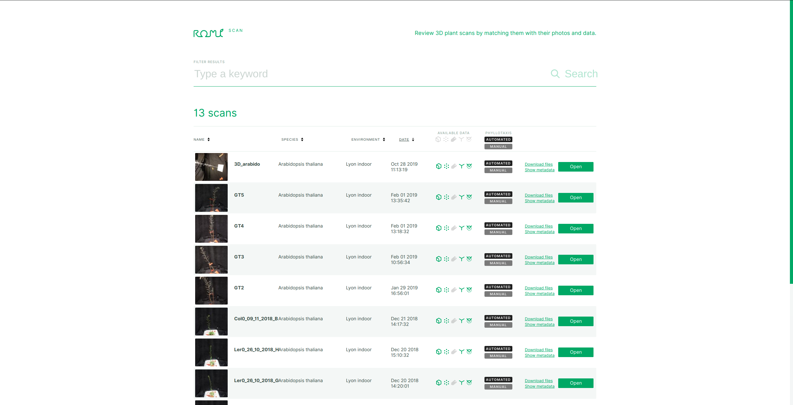
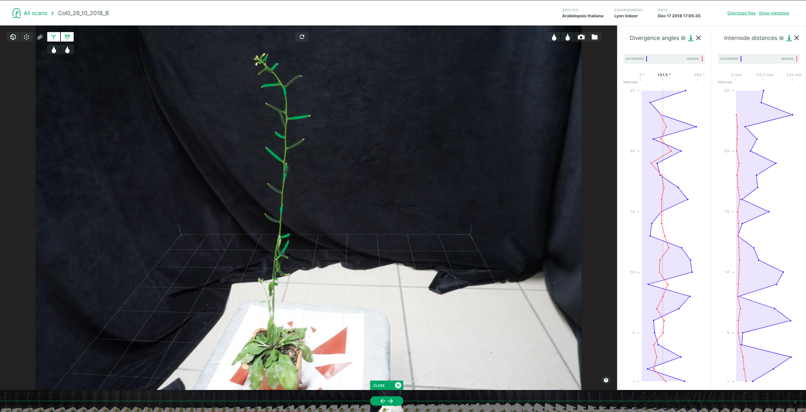

# Plant 3D Explorer

Welcome to the Plant 3D Explorer repository.
It is the home of our webapp dedicated to the exploration of single plant acquisitions and reconstruction.

 

For a general documentation on the whole ROMI project, head over [here](https://docs.romi-project.eu).


## Requirements
You will need `npm` to use this package.
It comes with `nodejs`, as per the official [instruction](https://github.com/nodesource/distributions/blob/master/README.md).
To install v16.X, for ubuntu:
```shell
# Using Ubuntu
curl -fsSL https://deb.nodesource.com/setup_16.x | sudo -E bash -
sudo apt-get install -y nodejs
```
For other distro look [here](https://github.com/nodesource/distributions/blob/master/README.md) or [here](https://nodejs.org/en/download/) for non linux distro.
To make sure everything works fine, your version of nodejs must be >= 10, and your version of npm must be >= 6.
To test it:
```shell
node -v
npm -v
```

## Installation
First clone the `plant-3d-explorer` git repository and enter the downloaded folder:
```bash
git clone https://github.com/romi/plant-3d-explorer.git
cd plant-3d-explorer
```

### ```npm install```
This is needed to install the dependencies of the project. At the root of the project directory, execute the following command:
```bash
npm install
```

## Test and run the webapp client
Still at root of the project directory, you can run:
### ```npm test```
This will run the tests for the project. It will permanently run and run again on files when they are changed. Multiple commands are available, see [this](https://create-react-app.dev/docs/running-tests/) for more info.

Each test file is located with the component it is testing. So the tests for the file `src/ScanList/index.js` are located in `src/Scanlist/index.test.js`.

### ```npm start```
To run the app in the development mode, just execute :
```bash
npm start
```
After a brief, the terminal should display:
```
Compiled successfully!

You can now view sony_visualiseur-plantes-3d in the browser.

  Local:            http://localhost:3000/
  On Your Network:  http://192.168.0.18:3000/

Note that the development build is not optimized.
To create a production build, use npm run build.
```

Then, open [http://localhost:3000](http://localhost:3000) to view it in the browser.

You need to add a file `.env.local` at project's root to set the `API URL`:
```
REACT_APP_API_URL='{`API URL}'
```
Without this, the app will use `http://localhost:5000`.

To use a local database, you must run the data storage server [from this repository](https://github.com/romi/plantdb).

### `npm run build`
Builds the app for production to the `build` folder.

It correctly bundles React in production mode and optimizes the build for the best performance.

The build is minified, and the filenames include the hashes.

Your app is ready to be deployed!

See the section about [deployment](https://facebook.github.io/create-react-app/docs/deployment) for more information.


## Docker container

### Build docker image
To build the image, at the root directory of the repo:
```bash
docker build -t roboticsmicrofarms/plant_3d_explorer:2.1 .
```
To run it:
```bash
docker run -it -p 3000:3000 roboticsmicrofarms/plant_3d_explorer:2.1
```
Once it's up, you should be able to access the viewer here: http://localhost:3000/

**important**:
> Use `chrome` as `firefox` has some issues with the used JavaScript libraries!

Push it on `roboticsmicrofarms` docker hub:
```bash
docker push roboticsmicrofarms/plant_3d_explorer:2.1
```
This requires a valid account, token and existing repository (`plant_3d_explorer`) on docker hub!

### Use pre-built docker image
First you need to pull the docker image:
```bash
docker pull roboticsmicrofarms/plant_3d_explorer
```
Then you can run it with:
```bash
docker run -p 3000:3000 roboticsmicrofarms/plant_3d_explorer
```


## Docker compose
To use a local database, for testing or development, we provide a docker compose recipe that:

1. start a `PlantDB` container using `roboticsmicrofarms/plantdb`
2. start a `Plant 3D Explorer` container using `roboticsmicrofarms/plant_3d_explorer`

**note**:
> You need `docker-compose` installed, see 
[here](https://docs.docker.com/compose/install/).

### Use pre-built docker image
From the directory containing the `docker-compose.yml` in a terminal:
```bash
export ROMI_DB=<path/to/db>
docker-compose up -d 
```
**important**:
> Do not forget to set `ROMI_DB`, the path to the database.

**note**:
To stop the containers: 
```bash
docker-compose stop
```

### Use local builds
To use local builds for development or debugging purposes:

1. build your image following the instructions above and use a specific tag like `debug`
2. edit the `docker-compose.yml` file to add the previously defined tag to the name of the image to start


## Technical documentation

### view
https://romi.github.io/plant-3d-explorer/

### contribute

The documentation of this package is done by [docz](https://www.docz.site/).
To install it, and its dependencies, do:
```bash
npm install docz react react-dom
```

Then:
```bash
npm run docz:dev
```

If you experience any difficulty with `docz`, head over [here](https://www.docz.site/docs/getting-started).
